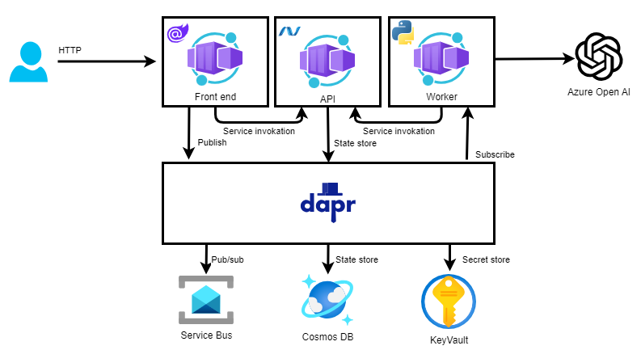

# vitas-dapr-workshop
[](https://codespaces.new/arnoldboersma/vitas-dapr-workshop)

[Hands-on-guide :](https://arnoldboersma.github.io/vitas-dapr-workshop/)

Welcome to the **Vitas Dapr, Azure Container Apps Workshop**. You'll be experimenting with Azure Serverless services in multiple labs to achieve a real world scenario. Don't worry, even if the challenges will increase in difficulty, this is a step by step lab, you will be guided through the whole process.

During this workshop you will have the instructions to complete each steps. It is recommended to search for the answers in provided resources and links before looking at the solutions placed under the 'Toggle solution' panel.

## Summarizer

**Summarizer** is an application designed to demonstrates how to build a, intelligent cloud native application using Dapr, Containers Apps and Open AI. It is composed of multiple microservices.



**Summarizer Blazor App (Front-end)** : A Blazor SSR application that allows to browse all summaries and eventually queue new links to be summarized.

**Requests API (ASP.NET Core)** : ASP.NET Core minimal API leveraging Dapr state management to store / get all requests of summaries. It allows to track and reuse previous summaries eventually generated.

**Requests Processor (Python)** : A Python application that allows to process summary requests in queue. If no summary has already being provided, it will prompt Azure Open AI to get a new summary. In any case, requests will be tracked using the requests API at the end of the process.

## Prepare OpenAI
- TODO Create Azure OpenAI resource
- Open Azure AI studio
Create model with name: `aca-dapr-gpt-35-turbo-01`

- get endpoint and key
- copy .dapr/summarizer-secrets-sample.json to .dapr/summarizer-secrets.json and fill in the secret values

## Start app

```bash
dapr run -f .
```

Open the app on port 11000, 12000 and 13000 the api has an swagger endpoint on /swagger, if you run the application in a githubcodespace the url's can be found as follows:


> If a port is missing, you can manually add the port to be forwarded.
>
> 

## Debug application

### Attach Debugger
- First start the application as described in `Start App`
- Open the command palette (Ctrl Shift + P)
- Type `Attach to a .NET`


- Type `frontend` (or one of the other apps) and select


- set a breakpoint!

### View logs
Output logs from the application and dapr are stored in each application in the `.dapr` folder.

### Zipkin


## Deploy to azure
[Deploy to Azure with the CLI](./deploy//containerapps/README.md)

## Troubleshoot
- Sometimes the Redis container crashes, check the status of the docker container with
```bash
docker ps
```
Or use the Docker plugin.
