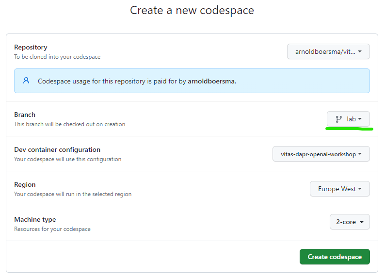

# Setup Codespace

You can run this application in a [GitHub Codespace](https://docs.github.com/en/codespaces/developing-in-codespaces/creating-a-codespace). This is useful for development and testing.

>  If you cannot or want to run the workshop in a GitHub Codespace you can clone the repository, checkout the `lab` branch and open in your own DevContainer, check the vscode [documentation](https://code.visualstudio.com/docs/devcontainers/containers).

1. Open the [vitas-dapr-workshop](https://github.com/arnoldboersma/vitas-dapr-workshop)

2. Click the `Open in Codespaces` button

3. Click the `Change options` button

4. Select the `lab` branch, the `vitas-dapr-openai-workshop` dev container configuration and click `create codespace`.

5. Wait for the Codespace to be created

6. Once the Codespace is ready, you can start working on the dev container through the browser or you can also connect to it using Visual Studio Code

> In case you're having the error message "Address already in use - bind", you can use the following command to free the address in use: `sudo lsof -i :8080` and then `sudo kill -9 <PID>`