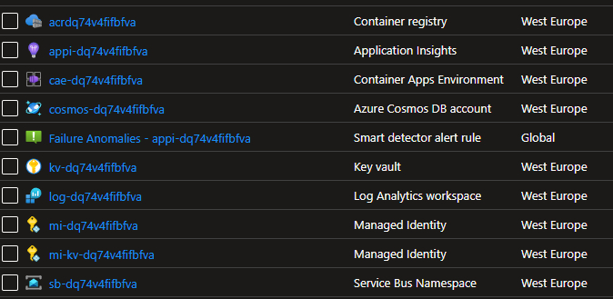

# Container Apps Environment Deployment (including Dapr Components)

{: .no_toc }

<details open markdown="block">
  <summary>
    Table of contents
  </summary>
  {: .text-delta }
- TOC
{:toc}
</details>

## General Information

In this section, we will deploy the infrastructure for the Container Apps environment. This includes the following resources:
*   Azure Container Apps Environment
*   Dapr components
*   Azure Container Registry
*   Azure Key Vault
*   Azure Service Bus
*   Managed Identities

Lucky for us, we already have bicep templates available to deploy all of these resources within the solution.
If you want to learn more about the bicep templates, you can find them in the [bicep](https://learn.microsoft.com/en-us/azure/azure-resource-manager/bicep/overview?tabs=bicep) but also in the [ACA Landing Zone Accelerator](https://github.com/Azure/aca-landing-zone-accelerator).

## Deploying the infrastructure

Within the `/deploy/containerapps` folder, you will find the following files:
*  `core.bicep` - This is the main bicep template that will deploy all of the infrastructure resources (except for the container apps)
*  `apps.bicep` - This is the bicep template that will deploy the container apps
*  `core.bicepparam` - This is the parameters file that will be used to deploy the infrastructure resources
    > Make sure you have created this file before deploying the infrastructure if not, based on the sample provided
* `/dapr/*.bicep` - These are the bicep templates that will deploy the Dapr components

### Deploy to Azure with the CLI

1. Ensure you have access to an Azure subscription and the Azure CLI installed
   ```bash
   az login --use-device-code
   az upgrade
   az account set --subscription "My Subscription"
   ```
1. Ensure you have access to an Azure subscription and the Azure CLI installed
   ```bash
   az extension add --name containerapp --upgrade
   ```
1. Create your own resourcegroup
1. Modify core.bicepparam with the secrets
1. Deploy the infrastructure
   ```bash
   az deployment group create --resource-group <your resourcegroup name> --template-file ./deploy/containerapps/core.bicep --parameters ./deploy/containerapps/core.bicepparam
   ```
1. Validate that the resources are created

