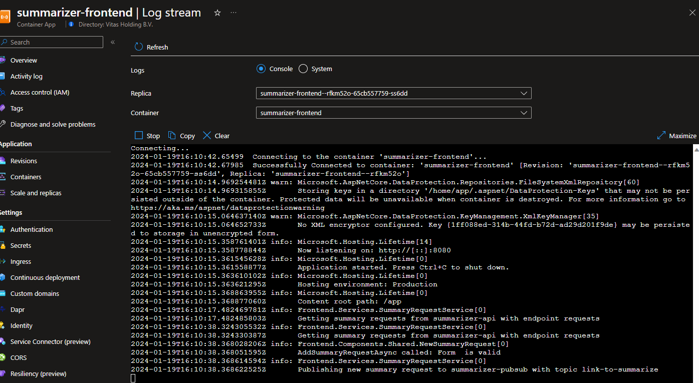
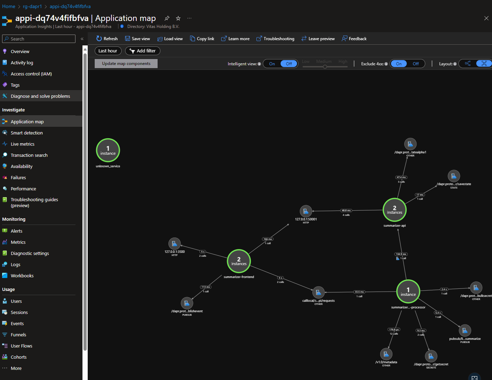

# Container Apps Deployment (Summarizer microservices)

{: .no_toc }

<details open markdown="block">
  <summary>
    Table of contents
  </summary>
  {: .text-delta }
- TOC
{:toc}
</details>

## General Information

In this section, we will deploy the Summarizer apps within the Container Apps environment. This includes the following resources:
*  Frontend Blazor App
*  Backend Requests API
*  Backend Requests Processor

In order to do so, we'll need to follow below steps :
* Execute docker build and push of all images into the container registry
* Deploy the container apps


## Deployment script

### Building / pushing the images

1. Give yourself acr push role for Container Registry in IAM

1. Log into Azure Container Registry
   You can get your registry name from your resource group in the Azure Portal
   ```bash
   az acr login --name <name container instance>
   ```
1. Build and push containers (from the root of the repository)
   ```bash
   dotnet publish ./src/frontend --os linux --arch x64 /t:PublishContainer -c Release
   docker tag frontend <name container instance>.azurecr.io/frontend:latest
   docker push <name container instance>.azurecr.io/frontend:latest

   dotnet publish ./src/api --os linux --arch x64 /t:PublishContainer -c Release
   docker tag api <name container instance>.azurecr.io/api:latest
   docker push <name container instance>.azurecr.io/api:latest

   docker build ./src/requests-processor/ -t <name container instance>.azurecr.io/request-processor:latest
   docker push <name container instance>.azurecr.io/request-processor:latest
   ```

### Adding the container apps

1. Deploy the application
   ```bash
   az deployment group create --resource-group <your own resourcegroup> --template-file ./deploy/containerapps/app.bicep
   ```

## Test the application

* Open the `frontend` app in your browser, and test the application by adding a new URL to summarize.
> You can get the FQDN of the frontend app by running the following command : `az containerapp show -n summarizer-frontend -g <resource-group-name> --query frontendEndpoint -o tsv` or using the Azure Portal in the overview section of the container app.

* Open the other containers apps logs stream to see the logs of the requests-api and requests-processor apps.



* Open Application insights and open the application map to view te relation between the services
