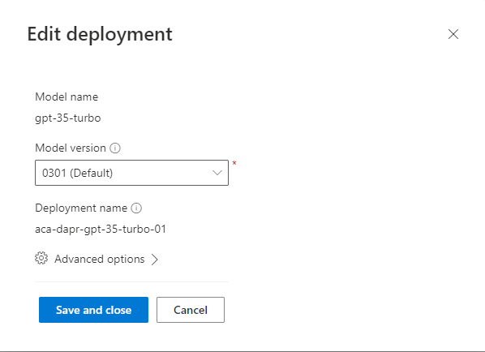
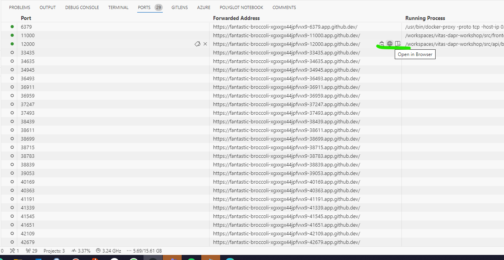
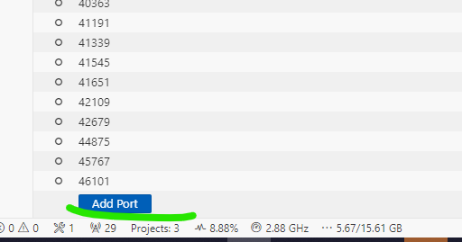
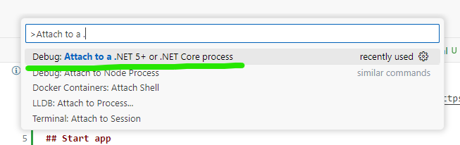
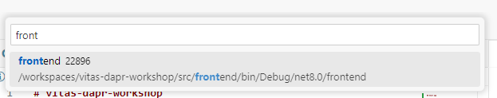
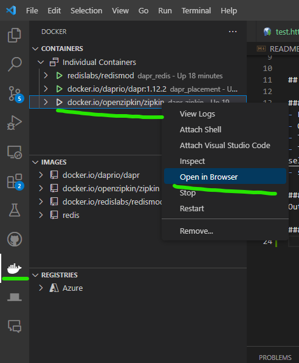
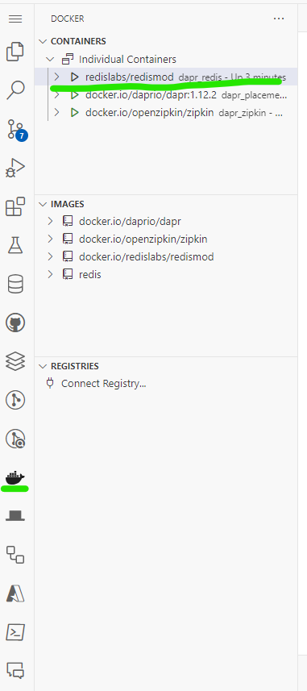

## Help

### Prepare OpenAI
- Create Azure OpenAI resource
- Open Azure AI studio
Create model with name: `aca-dapr-gpt-35-turbo-01`

- get endpoint and key

### Start app

Open the app on port 11000, 12000 and 13000 the api has an swagger endpoint on /swagger, if you run the application in a githubcodespace the url's can be found as follows:



> If a port is missing, you can manually add the port to be forwarded.
>
> 

### Debug application

#### Attach Debugger
- First start the application as described in `Start App`
- Open the command palette (Ctrl Shift + P)
- Type `Attach to a .NET`


- Type `frontend` (or one of the other apps) and select


- set a breakpoint!

#### View logs
Output logs from the application and dapr are stored in each application in the `.dapr` folder.

#### Zipkin


## Troubleshoot
- Sometimes the Redis container crashes, check the status of the docker container with
```bash
docker ps
```
Or use the Docker plugin.
